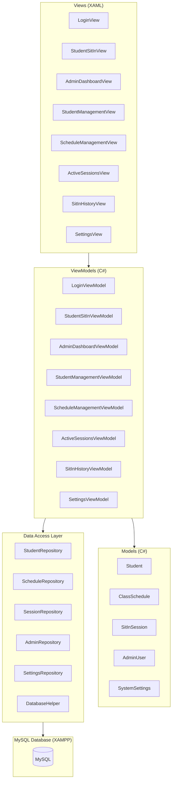
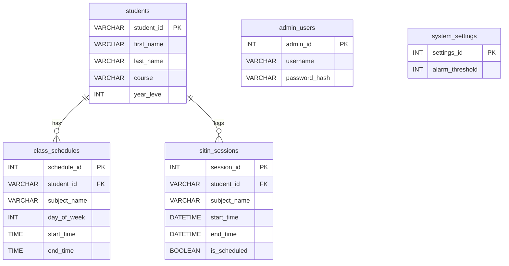

# Design: Laboratory Sit-in System

## Overview

The Laboratory Sit-in System is a WPF desktop application (C# .NET) that tracks student attendance in computer laboratories. Students log in via their student ID, and the system automatically matches their sit-in session to their class schedule. Administrators manage students, schedules, active sessions, and reports through a dashboard. The application uses a local MySQL database (via XAMPP) for persistence and follows the MVVM architectural pattern.

Key design goals:
- Real-time monitoring of active laboratory sessions
- Automatic session matching to class schedules based on day and time
- Admin-configurable alarm threshold for capacity management
- Clean separation of concerns via MVVM with a dedicated MySQL data access layer

## Architecture

The application follows a layered MVVM architecture:



### Layer Responsibilities

- **Views (XAML):** UI layout and data bindings. No business logic. Bind to ViewModel properties and commands.
- **ViewModels:** Expose observable properties and ICommand implementations. Contain presentation logic, validation, and coordinate between Views and the data access layer.
- **Models:** Plain C# classes (POCOs) representing domain entities. No framework dependencies.
- **Data Access Layer:** Repository classes that encapsulate all MySQL operations using `MySql.Data.MySqlClient`. Each repository handles CRUD for one entity type. `DatabaseHelper` manages connection string and connection lifecycle.

### Navigation

A main `MainWindow` hosts a `ContentControl` whose content is swapped between Views. A `NavigationService` (or simple ViewModel-based navigation) manages which View is active. The app starts on `LoginView`; successful admin login navigates to `AdminDashboardView`.

## Components and Interfaces

### Models

```csharp
public class Student
{
    public string StudentId { get; set; }
    public string FirstName { get; set; }
    public string LastName { get; set; }
    public string Course { get; set; }
    public int YearLevel { get; set; }
    public string FullName => $"{FirstName} {LastName}";
}

public class ClassSchedule
{
    public int ScheduleId { get; set; }
    public string StudentId { get; set; }
    public string SubjectName { get; set; }
    public DayOfWeek DayOfWeek { get; set; }
    public TimeSpan StartTime { get; set; }
    public TimeSpan EndTime { get; set; }
}

public class SitInSession
{
    public int SessionId { get; set; }
    public string StudentId { get; set; }
    public string StudentName { get; set; }
    public string SubjectName { get; set; }
    public DateTime StartTime { get; set; }
    public DateTime? EndTime { get; set; }
    public bool IsScheduled { get; set; }
    public TimeSpan Duration => (EndTime ?? DateTime.Now) - StartTime;
}

public class AdminUser
{
    public int AdminId { get; set; }
    public string Username { get; set; }
    public string PasswordHash { get; set; }
}

public class SystemSettings
{
    public int SettingsId { get; set; }
    public int AlarmThreshold { get; set; }
}
```

### Data Access Interfaces

```csharp
public interface IStudentRepository
{
    List<Student> GetAll();
    Student GetById(string studentId);
    List<Student> Search(string query);
    void Add(Student student);
    void Update(Student student);
    void Delete(string studentId);
}

public interface IScheduleRepository
{
    List<ClassSchedule> GetByStudentId(string studentId);
    ClassSchedule GetActiveSchedule(string studentId, DayOfWeek day, TimeSpan currentTime);
    void Add(ClassSchedule schedule);
    void Update(ClassSchedule schedule);
    void Delete(int scheduleId);
    bool HasOverlap(string studentId, DayOfWeek day, TimeSpan start, TimeSpan end, int? excludeId = null);
}

public interface ISessionRepository
{
    List<SitInSession> GetActiveSessions();
    SitInSession GetActiveSessionByStudent(string studentId);
    List<SitInSession> GetHistory(DateTime? from, DateTime? to, string studentId, string subject);
    void StartSession(SitInSession session);
    void EndSession(int sessionId, DateTime endTime);
    int GetActiveSessionCount();
}

public interface IAdminRepository
{
    AdminUser Authenticate(string username, string passwordHash);
}

public interface ISettingsRepository
{
    SystemSettings GetSettings();
    void UpdateAlarmThreshold(int threshold);
}
```

### DatabaseHelper

```csharp
public static class DatabaseHelper
{
    private static string _connectionString;

    public static void Initialize(string connectionString)
    {
        _connectionString = connectionString;
    }

    public static MySqlConnection GetConnection()
    {
        return new MySqlConnection(_connectionString);
    }
}
```

### ViewModel Base

```csharp
public class ViewModelBase : INotifyPropertyChanged
{
    public event PropertyChangedEventHandler PropertyChanged;

    protected void OnPropertyChanged([CallerMemberName] string name = null)
    {
        PropertyChanged?.Invoke(this, new PropertyChangedEventArgs(name));
    }

    protected bool SetProperty<T>(ref T field, T value, [CallerMemberName] string name = null)
    {
        if (EqualityComparer<T>.Default.Equals(field, value)) return false;
        field = value;
        OnPropertyChanged(name);
        return true;
    }
}
```

### RelayCommand

```csharp
public class RelayCommand : ICommand
{
    private readonly Action<object> _execute;
    private readonly Predicate<object> _canExecute;

    public RelayCommand(Action<object> execute, Predicate<object> canExecute = null)
    {
        _execute = execute;
        _canExecute = canExecute;
    }

    public bool CanExecute(object parameter) => _canExecute?.Invoke(parameter) ?? true;
    public void Execute(object parameter) => _execute(parameter);
    public event EventHandler CanExecuteChanged
    {
        add => CommandManager.RequerySuggested += value;
        remove => CommandManager.RequerySuggested -= value;
    }
}
```

### Key ViewModels

**ActiveSessionsViewModel** — manages the real-time session list and alarm:

```csharp
public class ActiveSessionsViewModel : ViewModelBase
{
    private readonly ISessionRepository _sessionRepo;
    private readonly ISettingsRepository _settingsRepo;
    private DispatcherTimer _refreshTimer;

    public ObservableCollection<SitInSession> ActiveSessions { get; }
    public bool IsAlarmActive { get; private set; }
    public int AlarmThreshold { get; private set; }
    public ICommand ForceEndSessionCommand { get; }
    public ICommand RefreshCommand { get; }

    // Timer ticks every 30 seconds to refresh active sessions
    // and check alarm threshold
}
```

**StudentSitInViewModel** — handles student login and session start:

```csharp
public class StudentSitInViewModel : ViewModelBase
{
    private readonly IStudentRepository _studentRepo;
    private readonly IScheduleRepository _scheduleRepo;
    private readonly ISessionRepository _sessionRepo;

    public string StudentIdInput { get; set; }
    public Student CurrentStudent { get; private set; }
    public ClassSchedule MatchedSchedule { get; private set; }
    public string StatusMessage { get; private set; }
    public ICommand LoginCommand { get; }

    // On login: validate student, check for active session,
    // match schedule, start session
}
```

## Data Models

### MySQL Database Schema

```sql
CREATE DATABASE IF NOT EXISTS laboratory_sitin;
USE laboratory_sitin;

CREATE TABLE students (
    student_id VARCHAR(20) PRIMARY KEY,
    first_name VARCHAR(100) NOT NULL,
    last_name VARCHAR(100) NOT NULL,
    course VARCHAR(100) NOT NULL,
    year_level INT NOT NULL
);

CREATE TABLE class_schedules (
    schedule_id INT AUTO_INCREMENT PRIMARY KEY,
    student_id VARCHAR(20) NOT NULL,
    subject_name VARCHAR(100) NOT NULL,
    day_of_week INT NOT NULL,          -- 0=Sunday, 1=Monday, ..., 6=Saturday
    start_time TIME NOT NULL,
    end_time TIME NOT NULL,
    FOREIGN KEY (student_id) REFERENCES students(student_id) ON DELETE CASCADE
);

CREATE TABLE sitin_sessions (
    session_id INT AUTO_INCREMENT PRIMARY KEY,
    student_id VARCHAR(20) NOT NULL,
    subject_name VARCHAR(100),
    start_time DATETIME NOT NULL,
    end_time DATETIME NULL,
    is_scheduled BOOLEAN NOT NULL DEFAULT FALSE,
    FOREIGN KEY (student_id) REFERENCES students(student_id) ON DELETE CASCADE
);

CREATE TABLE admin_users (
    admin_id INT AUTO_INCREMENT PRIMARY KEY,
    username VARCHAR(50) NOT NULL UNIQUE,
    password_hash VARCHAR(255) NOT NULL
);

CREATE TABLE system_settings (
    settings_id INT PRIMARY KEY DEFAULT 1,
    alarm_threshold INT NOT NULL DEFAULT 30
);

-- Seed default admin
INSERT INTO admin_users (username, password_hash) VALUES ('admin', SHA2('admin123', 256));

-- Seed default settings
INSERT INTO system_settings (settings_id, alarm_threshold) VALUES (1, 30);
```

### Entity-Relationship Diagram



### Key Data Flows

1. **Student Sit-In Login:** Student enters ID → `StudentRepository.GetById()` → `ScheduleRepository.GetActiveSchedule(studentId, today, now)` → `SessionRepository.GetActiveSessionByStudent()` (check no duplicate) → `SessionRepository.StartSession()`.

2. **Auto-End Session:** `DispatcherTimer` checks active sessions. For each scheduled session, if `DateTime.Now >= scheduledEndTime`, call `SessionRepository.EndSession()`.

3. **Alarm Check:** `ActiveSessionsViewModel` calls `SessionRepository.GetActiveSessionCount()` and compares against `SettingsRepository.GetSettings().AlarmThreshold`. Sets `IsAlarmActive` accordingly.

4. **Schedule Overlap Validation:** Before inserting/updating a schedule, `ScheduleRepository.HasOverlap()` queries for any existing schedule for the same student on the same day where time ranges intersect.
